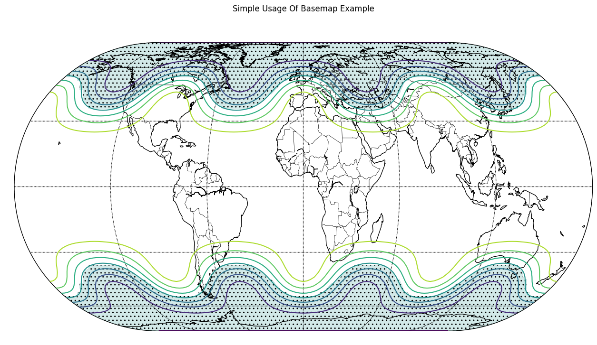

Basemap Plot with Chartly
=========================

Chartly supports geographic visualisation through basemap plotting
using the ``add_basemap(...)`` method. Users can display projected
contour data on a world map while keeping the plotting interface
simple and consistent with the rest of the package.

Example
-------

The example below generates contour data, projects it onto a basemap,
and visualises the result using Chartly's high-level interface.

The following customization options can be passed through the ``customs``
dictionary when creating a basemap plot:

- ``proj`` (str): Map projection type (e.g., "eck4")
- ``lon_0`` (int): Central longitude used during the basemap projection step
- ``draw_countries`` (bool): Draw country borders
- ``draw_parallels`` (bool): Draw latitude lines
- ``draw_meridians`` (bool): Draw longitude lines
- ``mask`` (array-like of bool): Boolean mask used to control hatched regions; required when ``hatch`` is enabled and ``hatch_customs.get("type") == "mask"``.
- ``contour`` (bool): Enable contour plotting
- ``hatch`` (bool): Enable hatching; when ``hatch_customs["type"] == "mask"``, hatched regions are determined by ``mask``.
- ``hatch_customs`` (dict): Customization options for hatching (for example, ``{"type": "mask"}``).

.. code-block:: python

    import chartly
    import numpy as np

    super_axes_labels = {
        "super_title": "Simple Usage Of Basemap Example",
        "share_axes": False,
    }

    plot = chartly.Chart(super_axes_labels)

    # Define grid size (latitude x longitude)
    nlats, nlons = 73, 145

    # Create latitude and longitude grids
    delta = 2.0 * np.pi / (nlons - 1)
    lats = 0.5 * np.pi - delta * np.indices((nlats, nlons))[0, :, :]
    lons = delta * np.indices((nlats, nlons))[1, :, :]

    # Generate sample data over the grid
    wave = 0.75 * (np.sin(2.0 * lats) ** 8 * np.cos(4.0 * lons))
    mean = 0.5 * np.cos(2.0 * lats) * ((np.sin(2.0 * lats)) ** 2 + 2.0)

    # Combine into final dataset for plotting
    z = wave + mean

    plot.add_basemap(
        lon=lons * 180.0 / np.pi,
        lat=lats * 180.0 / np.pi,
        values=z,
        customs={
            "proj": "eck4",
            "lon_0": 0,
            "draw_countries": True,
            "draw_parallels": True,
            "draw_meridians": True,
            "mask": z < 0,
            "contour": True,
            "hatch": True,
            "hatch_customs": {"type": "mask"},
        },
    )

    plot.render()

This example uses the Eckert IV projection and overlays contour data
onto a global map. Masking and hatching are applied to highlight
specific regions of the dataset, improving the visual distinction of
key areas.

