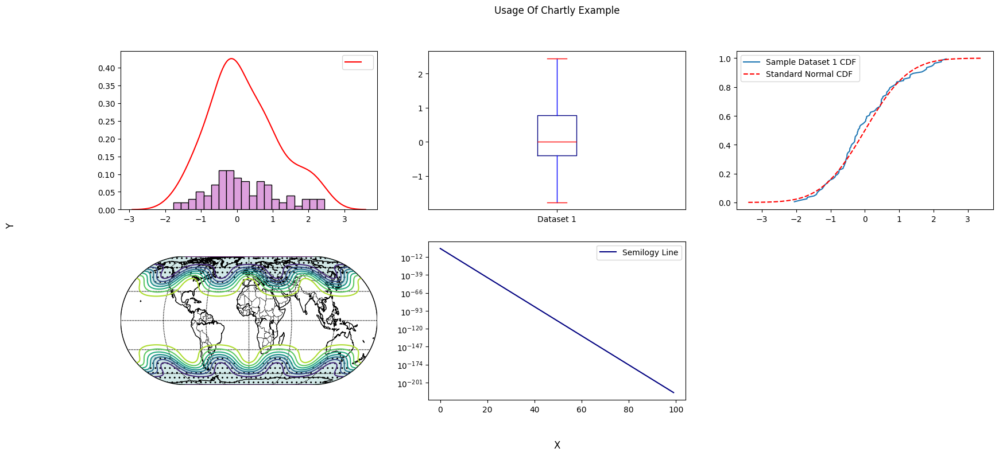

.. chartly documentation master file, created by
   sphinx-quickstart on Wed Oct 16 16:05:42 2024.
   You can adapt this file completely to your liking, but it should at least
   contain the root `toctree` directive.

Chartly
========

Overview
--------

**Chartly** is a simple plotting tool designed to help users create
scientific plots with ease. Whether you want to test a distribution for
normality or plot contours using a map of the globe, Chartly enables you
to generate visualisations with minimal effort. Chartly also allows users
to create multiple overlays and subplots on the same figure.

Requirements
------------

The chartly package requires the following packages:

- `matplotlib` >= 3.9.1
- `numpy` >= 1.26.4
- `scipy` >= 1.14.0
- `seaborn` >= 0.11.0

For geographic visualisation using basemaps, the following additional
dependency is required:

- `basemap` >= 2.0.0

Installation
------------

To install the chartly package, run the following command:

.. code-block:: shell

    pip install chartly

Usage
-----

The Chartly package currently supports the following scientific plots:

- Line Plot
- Histogram
- Contour Plot
- Normal Probability Plot
- Cumulative Distribution Function Plot
- Normal Cumulative Distribution Function Plot
- Density Plot
- Box Plot
- Basemap Plot

Chartly allows users to build plots by first creating a main figure and
then adding subplots to the figure. To initialize a main figure, users
can create a ``Chart`` instance and optionally pass a dictionary to
customize the figure. The dictionary supports the following keys:

- ``super_title`` (str): Title of the main figure
- ``super_xlabel`` (str): X-axis label
- ``super_ylabel`` (str): Y-axis label
- ``share_axes`` (bool): Share axes across subplots (default: True)

.. code-block:: python

   import chartly
   import numpy as np

   # 1. Define the main figure labels
   super_axes_labels = {
       "super_title": "Usage Of Chartly Example",
       "super_xlabel": "X",
       "super_ylabel": "Y",
       "share_axes": False,
   }

   # 2. Initialize the chart
   plot = chartly.Chart(super_axes_labels)

To create a plot, users can directly add a subplot with
``add_subplot(...)``. Additional plots can be added to the same subplot
with ``add_overlay(...)``.

.. code-block:: python

   # 3. Define some data
   data = np.random.randn(100)

   # 4. Add a subplot
   plot.add_subplot("histogram", data)

To overlay a new plot onto the current subplot, use ``add_overlay(...)``.

.. code-block:: python

   # 5. Overlay another plot
   plot.add_overlay("density", data)

To add multiple subplots at once, users can call ``add_subplots(...)``.

.. code-block:: python

   # 6. Add multiple subplots
   plot.add_subplots(
       ["boxplot", "normal_cdf"],
       data,
   )

To create a basemap plot, users can call ``add_basemap(...)`` and pass
longitude, latitude, and value grids.

.. code-block:: python

   # 7. Define basemap data
   nlats, nlons = 73, 145
   delta = 2.0 * np.pi / (nlons - 1)
   lats = 0.5 * np.pi - delta * np.indices((nlats, nlons))[0, :, :]
   lons = delta * np.indices((nlats, nlons))[1, :, :]
   wave = 0.75 * (np.sin(2.0 * lats) ** 8 * np.cos(4.0 * lons))
   mean = 0.5 * np.cos(2.0 * lats) * ((np.sin(2.0 * lats)) ** 2 + 2.0)
   z = wave + mean

   # 8. Add a basemap plot
   plot.add_basemap(
      lon=lons * 180.0 / np.pi,
      lat=lats * 180.0 / np.pi,
      values=z,
      customs={
         "proj": "eck4",
         "lon_0": 0,
         "draw_countries": True,
         "draw_parallels": True,
         "draw_meridians": True,
         "mask": z < 0,
         "contour": True,
         "hatch": True,
         "hatch_customs": {"type": "mask"},
      },
   )

Users can also customize subplot axes.

- Axes can be scaled (e.g., linear → log)
- The base of the log scale can be changed
- Ensure axes are not shared when modifying scales

.. code-block:: python

   # 9. Define a custom function
   exp_func = lambda x: np.e ** (-500 * x + 2)

   x = np.linspace(0, 1, num=100)
   y = list(map(exp_func, x))

   # 10. Add customized subplot
   plot.add_subplot(
       "line_plot",
       y,
       axes_labels={"scale": "semilogy", "base": 10, "linelabel": "Semilogy Line"},
   )

Finally, render the figure using ``render()``.

.. code-block:: python

   # 11. Render the figure
   plot.render()

To save the figure, use the ``save()`` method.

.. code-block:: python

   # 12. Save the figure
   plot.format = "jpg"
   plot.fname = "my_plot"
   plot.save()

.. toctree::
   :maxdepth: 2
   :caption: Contents:

   Plot
   Multiplots
   Basemap

Indices and tables
==================

* :ref:`genindex`
* :ref:`modindex`
* :ref:`search`